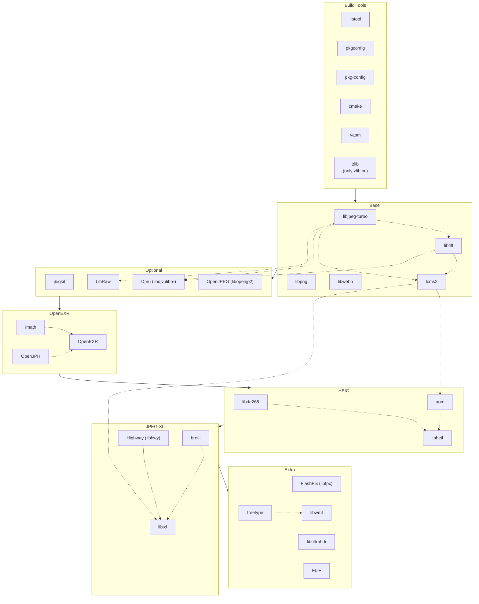

# libs.md - Optional library building chart

```mermaid
flowchart TD

subgraph tools [Build Tools]
  libtool
  pkgconfig
  pkg-config
  cmake
  yasm
  zlib["zlib<br/>(only zlib.pc)"]
end

tools -->  base
subgraph base [Base]
  libjpeg-turbo
  libpng
  libtiff
  libwebp
  lcms2
end
libjpeg-turbo -.-> libtiff
libjpeg-turbo -.-> lcms2
libtiff -.-> lcms2

base --> optional
subgraph optional [Optional]
  jbigkit
  djvu["DjVu (libdjvulibre)"]
  LibRaw
  OpenJPEG["OpenJPEG (libopenjp2)"]
end
libjpeg-turbo -.-> djvu
libtiff -.-> djvu
libjpeg-turbo -.-> LibRaw

optional --> exr
subgraph exr [OpenEXR]
  Imath
  OpenJPH
  OpenEXR
end
Imath -.-> OpenEXR
OpenJPH -.-> OpenEXR

exr --> heic
subgraph heic [HEIC]
  libde265
  aom
  libheif
end
lcms2 -.-> aom
libde265 -.-> libheif
aom -.-> libheif

heic --> jxl
subgraph jxl [JPEG-XL]
  brotli
  highway["Highway (libhwy)"]
  libjxl
end
lcms2 -.-> libjxl
brotli -.-> libjxl
highway -.-> libjxl

jxl --> extra
subgraph extra [Extra]
  fpx["FlashPix (libfpx)"]
  libultrahdr
  FLIF
  freetype
  libwmf
end
freetype -.-> libwmf

```
